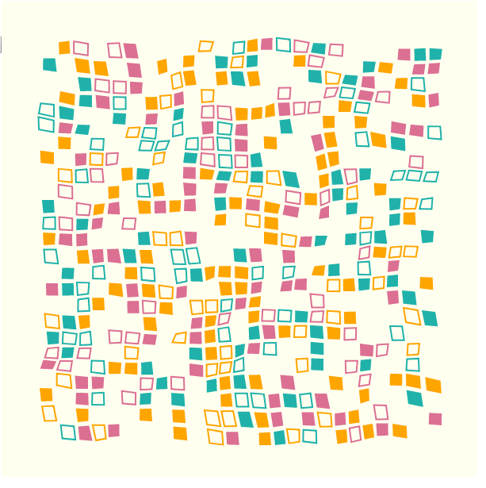

# Generative Art Experiment



Inspired by [Xavier Ho's presentation at 2018 Lambda Jam](http://lambdajam.yowconference.com.au/proposal/?id=6175), and [this article by Benjamin Kovach](https://www.kovach.me/posts/2018-03-07-generating-art.html), this repo contains a demonstration of the new [reflex-dom-svg](https://github.com/qfpl/reflex-dom-svg/) and [reflex-dom-canvas](https://github.com/qfpl/reflex-dom-canvas/) libraries.

This is all built using [nix] and the [obelisk] builder from [obsidian systems]. This repo is in a high state of flux and is heavily influencing further development of the aforementioned libraries. It is part show-case, part testing, and part cookbook.

If you want to build this package you will need to use [`nix`](https://nixos.org/), as the dependency requirements for GHCJS and some of the dependencies can get a bit wild.

To compile to JS and use the provided `index.html` (**Recommended**).

```bash
$ git clone https://github.com/mankyKitty/fantastic-waddle
$ cd fudge
$ nix build -f release.nix
$ <browser> $(pwd)/index.html &
```

To run a server using [obelisk](https://github.com/obsidiansystems/obelisk):

```shell
$ ob run
```

This will build everything and give you a locally running server to host the examples. The manner in which Reflex orchestrates the instructions to the frontend is not terribly efficient for the purposes of animation at this scale. So some brittleness is expected.
